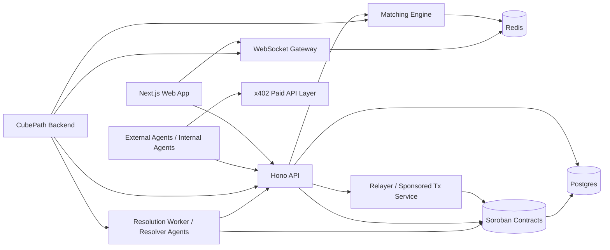
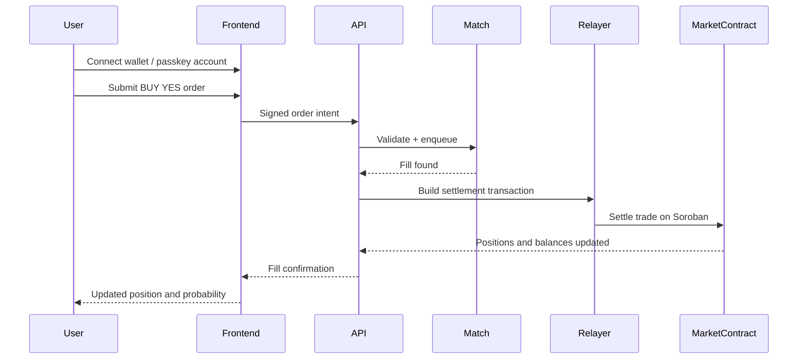
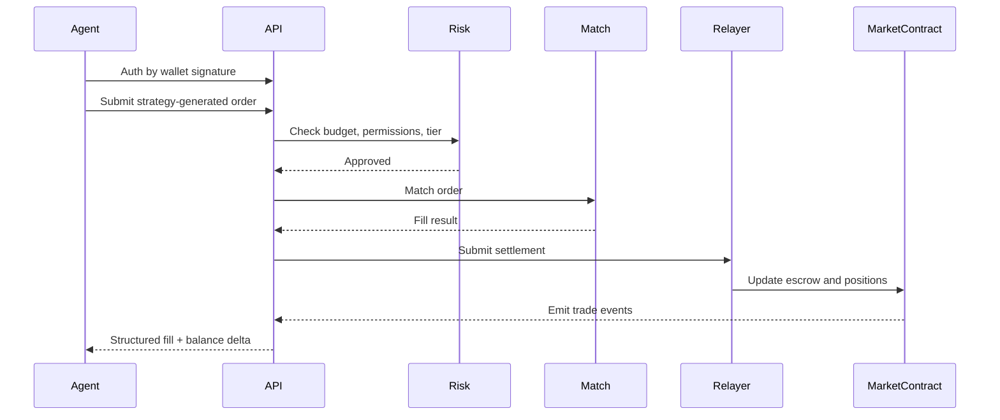
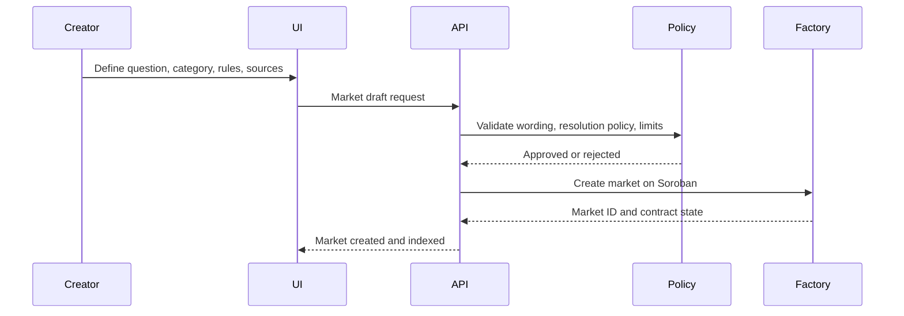
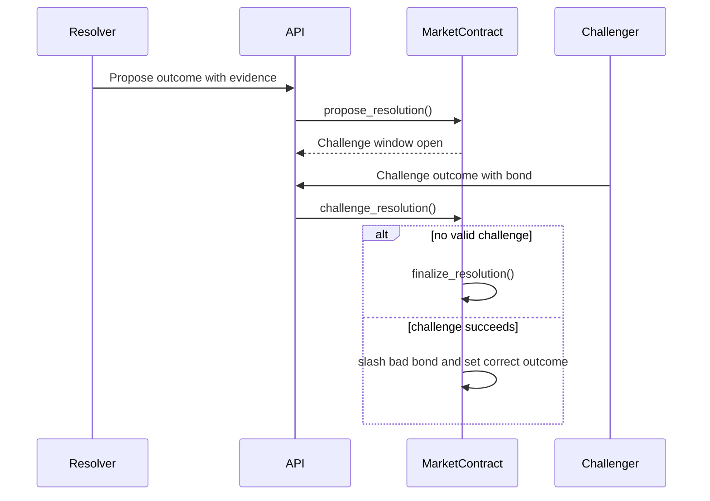

# Amazones System Design

## Final decisions
- Chain: **Stellar testnet first**, Soroban smart contracts
- Collateral: **USDC on Stellar via SAC**
- Market model: **binary YES/NO**
- Execution model: **hybrid off-chain CLOB, on-chain settlement**
- Resolution: **optimistic resolution with bonds and 48h challenge period**
- Human wallet UX: **Stellar Wallets Kit**
- Agent onboarding: **sponsored accounts** plus optional smart-account patterns
- Paid data APIs: **x402**
- Advanced machine-to-machine infra: **MPP later**
- Deployment stack: **Vercel + Supabase + CubePath**
- Database: **Supabase Postgres**
- Ephemeral live state: **Upstash Redis**

## General architecture

## Component responsibilities
### Soroban contracts
- canonical market definitions
- collateral escrow
- position balances
- settlement and redemption
- optimistic resolution and dispute bonds
- agent profile and reputation state

### API and matching engine
- signed order intake
- risk checks
- off-chain sequencing and matching
- settlement orchestration
- market metadata and semantic indexing

### Deployment mapping
- Vercel hosts the Next.js frontend and any minimal stateless public routes.
- CubePath hosts the Hono API, websocket gateway, matching engine, and background workers.
- Supabase stores persistent application data and can provide selected platform features.

### Postgres
- market metadata
- off-chain order state
- fill history
- agent configs
- audit trails

### Redis
- current order book
- websocket fanout
- short-lived intents and quote caches

### Relayer / sponsored tx
- gas abstraction
- agent onboarding
- sponsored settlement or user-triggered actions where appropriate

## Human trade flow

## Agent trade flow

## Market creation flow

## Resolution flow

## Key product rules
- Markets are binary in MVP.
- Prices are displayed as probabilities and share prices.
- Order matching is off-chain; ownership and payout are on-chain.
- Outcome shares are internal ledgered positions in MVP, not freely transferable tokens.
- Every market must include structured resolution policy metadata.

## Security posture
- OpenZeppelin relayer and security tooling preferred where possible.
- Pause controls for critical contract flows.
- Replay protection on orders and settlement ids.
- Bonded resolution with explicit challenge windows.

## Non-MVP items deliberately deferred
- fully tokenized composable conditional positions
- multi-outcome markets
- MPP-native market-making channels
- ZK-backed reputation proofs

## References
- [01-stellar-ecosystem-overview.md](../research/01-stellar-ecosystem-overview.md)
- [02-prediction-market-architecture.md](../research/02-prediction-market-architecture.md)
- [03-oracles-research.md](../research/03-oracles-research.md)
- [04-x402-and-mpp-research.md](../research/04-x402-and-mpp-research.md)
