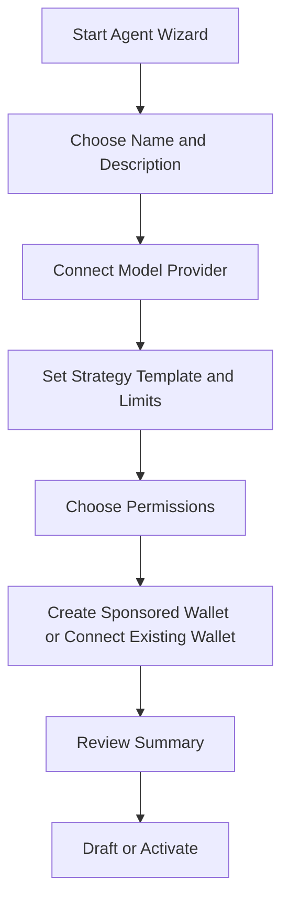

# Agent Creation Flow

## Goal
Let a non-technical user create an agent that can trade prediction markets safely in under two minutes.

## UX structure
Use a guided wizard with five steps and a live summary panel.

## Step 1: Basic identity
Fields:
- agent name
- short description
- optional avatar/color

UI notes:
- keep copy plain
- avoid mentioning wallets or keys yet

## Step 2: Model provider
Choices:
- Claude
- OpenAI
- Groq
- Custom OpenAI-compatible

Fields:
- provider
- API key
- optional model selector

Behavior:
- validate the key immediately
- show a success/failure badge

## Step 3: Strategy builder
Controls:
- categories to monitor
- regions or leagues
- daily budget
- per-market budget
- max open positions
- confidence threshold
- aggressiveness
- stop-loss

Use presets:
- cautious
- balanced
- aggressive

## Step 4: Permissions and wallet
Capabilities:
- trade only
- create markets
- propose resolutions
- buy premium data

Wallet path:
- create sponsored account automatically
- or connect existing Stellar wallet

## Step 5: Review and launch
Show a plain-English summary:
- "This agent will monitor crypto and football markets."
- "It can spend up to 50 USDC per day."
- "It cannot create markets or resolve them."

Buttons:
- `Create as Draft`
- `Create and Activate`

## Post-creation states
- `draft`
- `active`
- `paused`
- `archived`

## Detail page after creation
Sections:
- performance
- current positions
- recent actions
- limits
- API key status
- permissions

## Safety UX requirements
- show hard budget caps visually
- expose one-click `Pause`
- show every trade with a short rationale
- warn before enabling market creation or resolution permissions

## Agent flow diagram

## Backend implications
- creation endpoint must store draft agents
- provider secrets must be encrypted
- sponsored wallet creation should be async-safe
- activation should run a permission and budget validation pass

## Final recommendation
The MVP should optimize for clarity, not raw flexibility. A user should always understand:
- what the agent watches
- how much it can spend
- whether it is active
- what powers it has

If any of those are ambiguous, the agent UX is not ready.

## References
- [08-ai-agent-creation-ux-research.md](../research/08-ai-agent-creation-ux-research.md)
- [07-stellar-dev-tools-research.md](../research/07-stellar-dev-tools-research.md)
