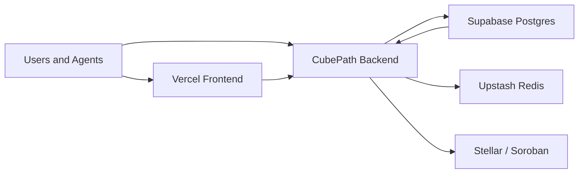

# Deployment Topology

## Goal
Define the deployment structure for Amazones clearly enough that implementation does not drift into an ad hoc platform mix.

## Chosen deployment stack
The planned deployment stack for Amazones is:
- **Vercel**
- **CubePath**
- **Supabase**
- **Upstash Redis**

This is the stack the project should use for the MVP.

## Explicit alternatives that are documented but not selected
The following remain documented only as alternatives and are **not planned for use**:
- **Neon**
- **Railway**

## Platform responsibilities

## Vercel
### Role
- Host the Next.js frontend
- Serve marketing pages
- Serve lightweight stateless routes if useful

### Why Vercel
- Best deployment experience for Next.js
- Fast previews and branch deployments
- Excellent CDN and frontend ergonomics

### What should not live here
- matching engine
- websocket gateway
- long-running workers
- settlement queue consumers

## CubePath
### Role
- Host the Hono API
- Host the matching engine
- Host the websocket gateway
- Host background workers
- Host resolution automation

### Why CubePath
- Better fit for stateful backend workloads
- Fits the available low-cost/credit-based plan
- Keeps core backend logic off Vercel

### What should live here
- order intake and validation
- matching and sequencing
- settlement orchestration
- x402 verification/paid API middleware if backend-owned
- cron and event-driven jobs

## Supabase
### Role
- Primary PostgreSQL database
- Persistent application data
- Optional Realtime features
- Optional Edge Functions for simple support tasks

### Why Supabase
- Strong default managed Postgres choice
- Useful product surface beyond just the database
- Good fit for metadata, agent configs, and application records

### What should live here
- markets table
- agent configuration
- user/session metadata
- trade history mirror
- audit/event records
- resolver evidence metadata

## Upstash Redis
### Role
- ephemeral order book state
- websocket fanout support
- short-lived quote caches
- sequencing or rate-limit helper state where needed

### Why
- Good free-first option for live system state
- Simpler than self-hosting Redis for MVP

## Recommended topology

## Subdomain recommendation
- `amazones.app` -> frontend on Vercel
- `api.amazones.app` -> backend API on CubePath
- `ws.amazones.app` -> websocket gateway on CubePath
- `data.amazones.app` -> optional x402-paid data endpoints on CubePath

This keeps the architecture legible and avoids mixing frontend and stateful services under one platform assumption.

## Environment separation
At minimum:
- `development`
- `staging`
- `production`

### Suggested mapping
- Vercel preview deployments for frontend branches
- one CubePath service for staging, one for production
- one Supabase project for staging, one for production if budget allows

## Suggested service breakdown on CubePath
- `api-service`
- `matching-service`
- `worker-service`
- `ws-service`

For a very small MVP, these can start as one deployable service and split later.

## Deployment rules
- Frontend belongs on Vercel.
- Stateful backend belongs on CubePath.
- Persistent relational data belongs on Supabase.
- Redis is only for ephemeral state, never the source of truth.
- On-chain truth still lives on Stellar for settlement and final market outcome.

## Operational notes
- Keep matching-engine state reproducible from persisted events where possible.
- Do not make Redis the canonical record of fills.
- Keep contract settlement idempotent at the backend layer.
- Treat Supabase as the source of truth for application records and Stellar as the source of truth for settlement state.

## Why not Vercel-only
A full Vercel deployment is not recommended because:
- websocket support is not a natural fit there
- the matching engine is stateful
- long-running or queue-driven work belongs elsewhere

Vercel should remain a frontend-first platform in this architecture.

## Why not Neon
Neon is acceptable as a Postgres alternative, but not selected because Supabase gives a more complete MVP platform and aligns better with the current preference.

## Why not Railway
Railway is acceptable as a hosting alternative, but not selected because CubePath is the preferred backend platform in this plan.

## Final recommendation
The deployment topology for Amazones should be:
- **Vercel for frontend**
- **CubePath for backend**
- **Supabase for persistent data**
- **Upstash Redis for ephemeral real-time state**

This is the intended deployment architecture for the MVP and should be treated as the default unless the architecture is explicitly revised later.

## References
- [01-system-design.md](./01-system-design.md)
- [10-infrastructure-and-costs.md](../research/10-infrastructure-and-costs.md)
