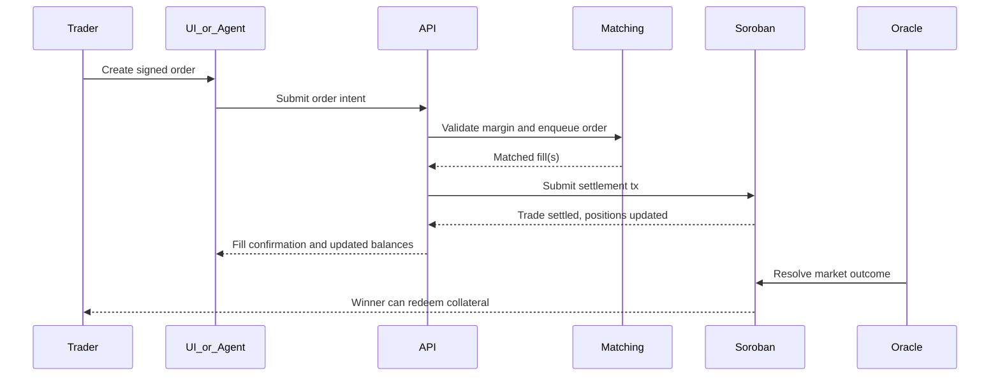

# Prediction Market Architecture Research

## Scope
This document studies the core technical patterns behind prediction markets and evaluates which architecture is best for Amazones on Stellar.

## Resource: Gnosis Conditional Tokens Framework (CTF)
### Description
CTF is the canonical reference architecture for tokenized outcome positions. It turns collateral into outcome-linked claims that can be split, merged, and redeemed after resolution.

### How it works
- A condition is prepared for an event.
- Collateral is split into outcome claims, often binary YES/NO.
- Users trade positions externally or inside other market mechanisms.
- After resolution, winning tokens redeem for collateral based on the payout vector.

### Pros for Amazones
- Clean conceptual model for representing binary claims.
- Battle-tested mental model for redemption and settlement.
- Useful reference for outcome accounting even if not implemented literally on Soroban.

### Cons for Amazones
- Directly cloning CTF on Stellar would add complexity before product-market fit is proven.
- ERC-1155-style composability is not a free port to Soroban.
- Full split/merge primitives may be overkill for the MVP if a simpler ledgered-position model works.

### Verdict
**Use partially.** Use CTF as the accounting reference, not as a literal implementation target for MVP v1.

## Resource: AMM-based markets
### Description
AMM prediction markets maintain liquidity by algorithm instead of matching discrete bids and asks.

### How it works
- Liquidity providers seed pools.
- Traders buy or sell against a curve.
- Price emerges from pool balances or a market scoring rule.

### Pros for Amazones
- Easier liquidity bootstrap when order-book depth is thin.
- Fully on-chain design is easier to reason about than matching engines.
- Good fit for small long-tail markets.

### Cons for Amazones
- Worse price discovery for headline markets.
- Capital inefficient compared with order books.
- Harder to explain to casual users and harder to optimize for agent execution quality.

### Verdict
**Discard for MVP primary architecture.** Keep as a later extension for illiquid long-tail markets.

## Resource: CLOB-based markets
### Description
A central limit order book matches explicit bids and asks at user-selected prices.

### How it works
- Traders submit limit or market-style orders.
- Matching engine pairs compatible orders.
- Settlement updates ownership and locked collateral.

### Pros for Amazones
- Best UX match to Polymarket/Kalshi expectations.
- Better price precision and agent-friendly execution.
- Easier to expose structured market data for agents.

### Cons for Amazones
- Fully on-chain CLOB is inefficient on Stellar.
- Requires dependable sequencing, cancel semantics, and off-chain infrastructure.

### Verdict
**Use partially.** CLOB should be the user-facing market model, but matching should be off-chain for MVP.

## Resource: Polymarket hybrid model
### Description
Polymarket uses off-chain order handling with on-chain settlement, combining an exchange-like experience with trust-minimized collateral and payout.

### How it works
- Orders are signed off-chain.
- A matching system pairs orders.
- Settlement commits the matched trade to chain, with collateral and positions updated on-chain.
- Resolution then unlocks redemption of winning positions.

### Pros for Amazones
- Best fit for Stellar's current strengths.
- Keeps the chain responsible for escrow, balances, payout, and auditability.
- Lets Amazones ship a better UX for both humans and agents without waiting for high-throughput on-chain matching.

### Cons for Amazones
- Introduces operator trust in sequencing and availability.
- Needs careful signed-order design and replay protection.

### Verdict
**Use.** Hybrid off-chain matching plus on-chain settlement is the right MVP architecture.

## Recommended architecture for Amazones
### Core decision
Use a **hybrid CLOB**:
- Off-chain matching engine and order book
- On-chain market/collateral/position settlement on Soroban
- On-chain final redemption and market resolution

### Why this is the best fit on Stellar now
- It preserves low-cost on-chain settlement without forcing the order book on-chain.
- It is significantly more agent-friendly than AMMs because agents can optimize execution by price, size, and queue position.
- It keeps the product intuitive for humans because YES and NO look like shares, not LP math.

## Trade flow diagram

## MVP market mechanics
- Binary markets only.
- USDC collateral only.
- YES/NO positions represented as contract-managed balances, not necessarily freely transferrable tokens in v1.
- Signed order intents with expiration, nonce, price, size, side, and max slippage.
- Matching engine checks locked collateral before settlement.

## Non-MVP extensions
- Long-tail AMM pools for creator markets.
- Multi-outcome markets.
- Composable tokenized positions for external DeFi use.
- Shared liquidity or aggregator routing.

## Final recommendation
For Amazones, the technically defensible MVP is:
- CTF-inspired accounting
- Hybrid off-chain CLOB
- Soroban-based settlement and redemption
- Optimistic or oracle-assisted market resolution

That gives the best balance of execution quality, UX clarity, and feasibility in today's Stellar ecosystem.

## References
- https://docs.forkast.gg/conditional-tokens-framework
- https://github.com/gnosis/conditional-tokens-contracts
- https://polymarketguide.gitbook.io/polymarketguide/resolution/oracles
- https://developers.stellar.org/llms.txt
- https://developers.stellar.org/docs/build/apps/overview
